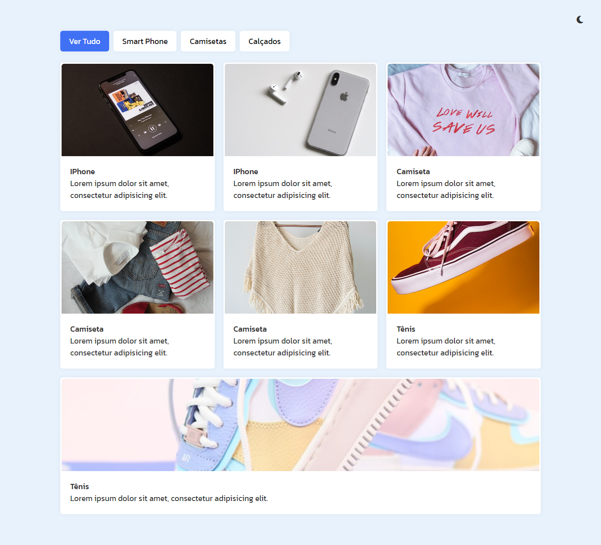

[Acesse o projeto aqui](https://henrydev1610.github.io/FilterGrid/)

# Galeria Filtrável com HTML, CSS e JavaScript

Este projeto é uma página web com uma galeria de itens, onde os usuários podem filtrar os itens exibidos através de botões. O objetivo deste projeto é treinar o desenvolvimento de layouts responsivos e aprofundar os conhecimentos em manipulação do DOM utilizando JavaScript.

## Funcionalidades

- Exibição de uma galeria de itens.
- Filtro dinâmico dos itens da galeria através de botões.
- Layout responsivo, adaptado para diferentes tamanhos de tela.
- Utilização de JavaScript para manipulação do DOM e filtragem dos itens.

## Tecnologias Utilizadas

- **HTML5**: Estrutura da página.
- **CSS3**: Estilização e design responsivo.
- **JavaScript (DOM)**: Filtragem de itens e manipulação de elementos da página.

## Como Utilizar

1. Clone o repositório:
   ```bash
   git clone https://github.com/seu-usuario/nome-do-repositorio.git
